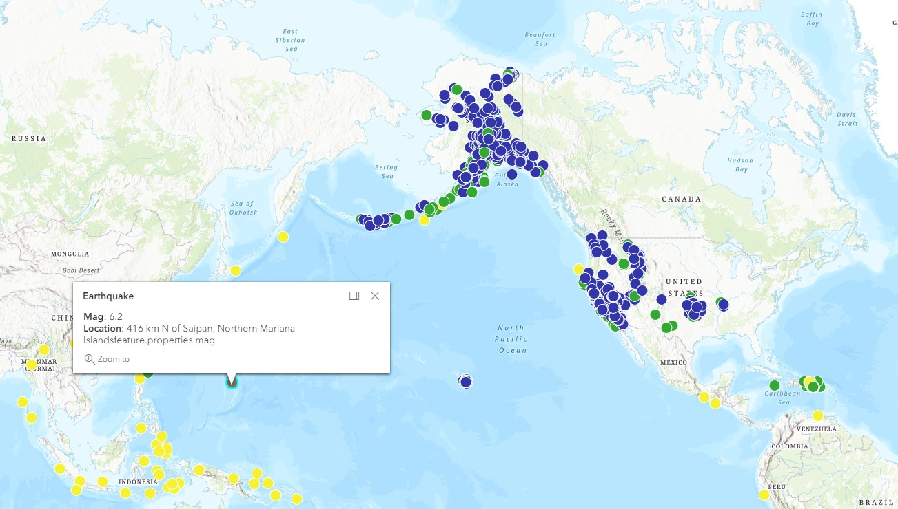

# Mapping with ArcGIS

This javascript code will display a map centered in Rexburg, ID using ArcGIS.  The map will contains dots representing all earthquakes in the past week (red > 6, yellow > 4, green > 2, blue < 2).  If you click on a dot, you will see a message showing the actual magnitude and the physical location.

The earthquake data is obtained by reading JSON data from the USGS website (https://earthquake.usgs.gov/earthquakes/feed/v1.0/geojson.php).

**Useful Websites**

* Create Starter App: https://developers.arcgis.com/labs/javascript/create-a-starter-app/
* Display Points: https://developers.arcgis.com/labs/javascript/display-point-line-and-polygon-graphics/
* Popup Templates: https://earthquake.usgs.gov/earthquakes/feed/v1.0/geojson.php
* Javascript JSON: https://www.w3schools.com/js/js_json_parse.asp

